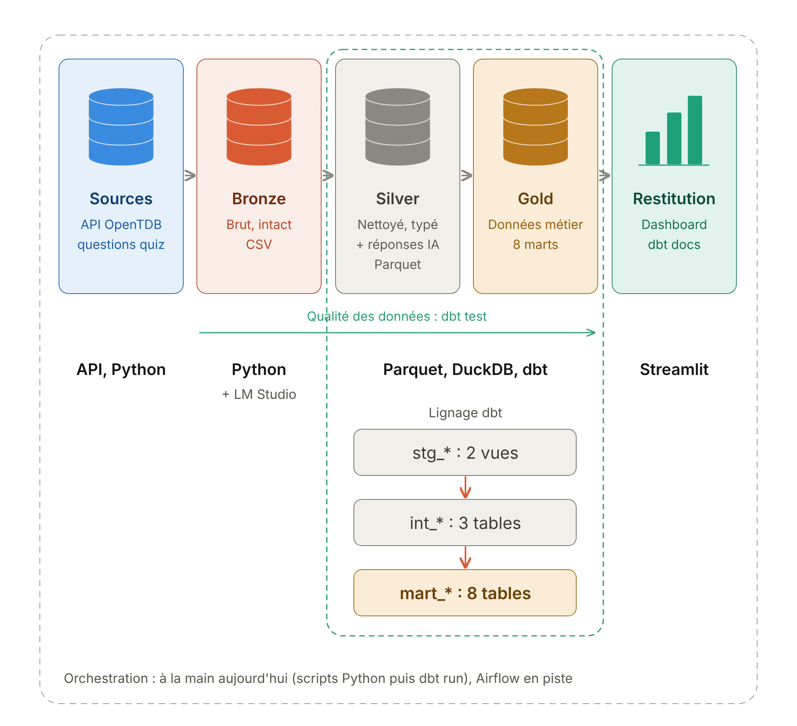

# Benchmark de modèles d'IA locaux sur Open Trivia Database

## 1. Résumé

Ce projet répond à une question : **des petits modèles de langage exécutés en local savent-ils répondre à des questions de culture générale, et à quel point le prompt change-t-il leur score ?**
Nous avons collecté les 5 299 questions de l'API Open Trivia Database (OpenTDB), puis interrogé 4 modèles locaux (de 1 à 8 milliards de paramètres) via LM Studio, avec 4 variantes de prompt chacun.
Cela représente 16 runs et 84 736 réponses. Pour chacune, nous mesurons la justesse (`ai_correct`), le respect du format demandé (`is_valid_format`) et le temps de réponse (`response_time`).
Principal enseignement : TODO : à compléter (meilleur modèle, taux de réussite, écart dû au prompt, voir la [section 12](#12-résultats-clés)).

Le pipeline suit une architecture médaillon : Bronze (CSV brut), Silver (Parquet), Gold (DuckDB), avec les transformations organisées dans dbt.

## Table des matières

1. [Résumé](#1-résumé)
2. [Équipe et répartition du travail](#2-équipe-et-répartition-du-travail)
3. [Architecture médaillon](#3-architecture-médaillon)
4. [Arborescence du dépôt](#4-arborescence-du-dépôt)
5. [Le pipeline étape par étape](#5-le-pipeline-étape-par-étape)
6. [Le benchmark](#6-le-benchmark)
7. [La correction des réponses](#7-la-correction-des-réponses)
8. [Le modèle de données dbt](#8-le-modèle-de-données-dbt)
9. [Qualité des données](#9-qualité-des-données)
10. [Installation et exécution de zéro](#10-installation-et-exécution-de-zéro)
11. [Le dashboard Streamlit](#11-le-dashboard-streamlit)
12. [Résultats clés](#12-résultats-clés)
13. [Choix techniques et justifications](#13-choix-techniques-et-justifications)
14. [Limites et pistes d'amélioration](#14-limites-et-pistes-damélioration)

---

## 2. Équipe et répartition du travail

| Membre | Rôle principal | Contributions |
|---|---|---|
| TODO : à compléter | TODO : à compléter | TODO : à compléter |
| TODO : à compléter | TODO : à compléter | TODO : à compléter |

Contexte : projet de fin de TP de Data Integration, M1, EFREI.

---

## 3. Architecture médaillon



> TODO : à compléter. Le fichier `docs/architecture.png` n'existe pas encore dans le dépôt. En attendant, voici le schéma en texte :

```text
API OpenTDB ──get_data.py──▶ BRONZE  bronze/questions_raw.csv            (CSV brut)
                                │
                     clean_questions.py
                                ▼
                            SILVER  silver/questions_clean.parquet        (Parquet)
                                │
              ai_all.py + LM Studio (localhost:1234)
                                ▼
                            SILVER  silver/ai_responses/part_*.parquet    (Parquet)
                                │
                              dbt  staging ─▶ intermediate ─▶ marts
                                ▼
                            GOLD    warehouse/trivial_questions.duckdb    (schéma gold)
                                │
                                ▼
                         Dashboard Streamlit (lecture seule)
```

| Couche | Contenu | Format | Produit par | Pourquoi |
|---|---|---|---|---|
| **Bronze** | Les questions telles que renvoyées par l'API : texte encodé en HTML, doublons inclus. | CSV (`bronze/questions_raw.csv`) | `src/get_data.py` | Garder une copie fidèle de la source. On peut tout recalculer sans rappeler l'API, qui est lente et limitée. |
| **Silver** | 1) Les questions nettoyées, dédoublonnées et identifiées. 2) Les réponses brutes des modèles, avec le prompt exact envoyé. | Parquet (`silver/questions_clean.parquet`, `silver/ai_responses/part_*.parquet`) | `src/clean_questions.py`, `src/ai_all.py` | Données propres et typées. Les listes (`incorrect_answers`, `choices`) restent des listes. La réponse brute est conservée telle quelle : la correction se fait plus loin, de façon rejouable. |
| **Gold** | Les tables métier : classement, performance par catégorie, par difficulté, effet du prompt, etc. | DuckDB (`warehouse/trivial_questions.duckdb`, schéma `gold`) | dbt (`src/models/marts`) | Tables prêtes à consommer par le dashboard, avec des indicateurs calculés une seule fois et testés. |

Dans DuckDB, les modèles dbt `staging` et `intermediate` sont rangés dans le schéma `silver`, et les `marts` dans le schéma `gold`.

---

## 4. Arborescence du dépôt

```text
tp_trivial/
├── README.md                     Ce document
├── requirements.txt              Dépendances Python figées (dbt-duckdb, lmstudio, pandas, streamlit...)
├── .python-version               Version de Python utilisée (3.14)
├── dbt_project.yml               Configuration dbt : chemins, matérialisations, schémas silver/gold
├── profiles.yml                  Connexion dbt vers warehouse/trivial_questions.duckdb
├── 01_bronze_to_silver.ipynb     Notebook d'exploration : diagnostic qualité et mise au point du nettoyage
│
├── bronze/
│   └── questions_raw.csv         BRONZE : 5 299 questions brutes OpenTDB
├── silver/
│   ├── questions_clean.parquet   SILVER : 5 296 questions nettoyées
│   └── ai_responses/
│       └── part_0001..0176.parquet  SILVER : 84 736 réponses brutes des modèles, par lots de 500
├── prompt/
│   ├── benchmark_config.csv      Plan d'expérience : 1 ligne = 1 run (modèle × prompt × paramètres)
│   └── prompt.csv                Fichier vide (non utilisé)
├── warehouse/
│   └── trivial_questions.duckdb  GOLD : base DuckDB créée par dbt (non versionnée, voir .gitignore)
│
├── src/
│   ├── get_data.py               Étape 1 : scraping de l'API OpenTDB vers Bronze
│   ├── clean_questions.py        Étape 2 : nettoyage Bronze vers Silver
│   ├── ai_all.py                 Étape 3 : enrichissement IA via LM Studio, tous les runs
│   ├── enrich_lmstudio.py        Ancienne version de l'enrichissement (API HTTP, non utilisée)
│   ├── test_enrich_ia.py         Essai d'un seul run sur quelques questions
│   ├── test_models.py            Vérifie que chaque modèle répond et estime la durée du benchmark
│   ├── get_data_test.py          Essai d'un appel unique à l'API (50 questions)
│   ├── models/
│   │   ├── sources.yml           Sources dbt : les fichiers Parquet de Silver
│   │   ├── staging/              stg_* : vues typées et renommées + schema.yml (tests)
│   │   ├── intermediate/         int_* : correction et enrichissement + schema.yml (tests)
│   │   └── marts/                mart_* : tables métier Gold
│   └── macros/
│       ├── generate_schema_name.sql  Utilise les schémas silver/gold tels quels
│       ├── normalize_answer.sql      Normalisation du texte des réponses
│       └── wilson_interval.sql       Intervalle de confiance de Wilson à 95 %
│
├── tests/
│   └── assert_unique_ai_response.sql Test dbt : pas de doublon question × run
│
└── app/                          TODO : à compléter (application Streamlit absente du dépôt)
```

Les dossiers `target/`, `logs/` et le fichier `.duckdb` sont générés par dbt et ignorés par Git.

---

## 5. Le pipeline étape par étape

### 5.1 Ingestion (Bronze)

| | |
|---|---|
| **Script** | `src/get_data.py` |
| **Entrée** | API `https://opentdb.com/api.php` |
| **Sortie** | `bronze/questions_raw.csv` : 5 299 lignes, colonnes `type`, `difficulty`, `category`, `question`, `correct_answer`, `incorrect_answers` |

Traitement :
1. Le script demande un **token de session** (`api_token.php?command=request`). Grâce à lui, l'API ne renvoie jamais deux fois la même question.
2. Il récupère les questions **par lots de 50**, en boucle, jusqu'à épuiser la base.
3. Il attend **5,5 secondes** entre deux appels, car l'API n'autorise qu'un appel toutes les 5 secondes.
4. Il gère les codes de retour de l'API :
   - `0` : succès, les questions sont ajoutées.
   - `1` ou `4` : il reste moins de questions que demandé. La taille du lot est divisée par deux, jusqu'à 1. Quand même un lot de 1 échoue, la base est épuisée.
   - `5` : limite de requêtes atteinte. Le script attend puis réessaie.
   - autre : le script s'arrête avec une erreur.
5. Il écrit un seul CSV. La liste `incorrect_answers` est sérialisée en JSON. Aucun nettoyage n'est fait : le texte reste encodé en HTML (`&quot;`, `&#039;`...).

### 5.2 Nettoyage (Bronze vers Silver)

| | |
|---|---|
| **Script** | `src/clean_questions.py` (logique mise au point dans `01_bronze_to_silver.ipynb`) |
| **Entrée** | `bronze/questions_raw.csv` |
| **Sortie** | `silver/questions_clean.parquet` : 5 296 lignes, 11 colonnes |

Traitement :
1. **Contrat Bronze** : 8 contrôles bloquants avant toute transformation (colonnes attendues, aucune valeur vide, `type` dans `multiple`/`boolean`, `difficulty` dans `easy`/`medium`/`hard`, `incorrect_answers` est une liste JSON, 3 mauvaises réponses pour un QCM, 1 pour un Vrai/Faux, bonne réponse `True` ou `False` pour un Vrai/Faux). Un seul échec arrête le script.
2. **Nettoyage du texte** de `category`, `question`, `correct_answer` et de chaque mauvaise réponse : décodage des entités HTML (`html.unescape`), suppression des tirets conditionnels invisibles, remplacement des espaces insécables, suppression des espaces en trop.
3. **Enrichissement** :
   - `category_group` : la famille de catégorie (`Entertainment: Film` donne `Entertainment`, `Science & Nature` donne `Science`).
   - `category_name` : la sous-catégorie (`Film`, ou `Nature` pour `Science & Nature`).
   - `difficulty_level` : 1, 2 ou 3.
   - `nb_options` : 4 pour un QCM, 2 pour un Vrai/Faux.
4. **Identifiant stable** `question_id` : les 12 premiers caractères du hash MD5 de `question || correct_answer` en minuscules. Le même contenu donne toujours le même identifiant, quel que soit l'ordre du scraping.
5. **Doublons** : les questions ayant le même `question_id` sont affichées puis supprimées (on garde la première). On passe de 5 299 à 5 296 questions.
6. **Contrôles après nettoyage** : 7 contrôles bloquants (identifiant unique, plus aucune entité HTML, plus d'espaces en trop, aucun texte vide, bonne réponse absente des mauvaises réponses, aucune option en double, `nb_options` cohérent avec le type).
7. **Écriture puis relecture** du Parquet, pour vérifier le nombre de lignes, les colonnes et le type liste de `incorrect_answers`.

Colonnes de sortie : `question_id`, `type`, `difficulty`, `difficulty_level`, `category`, `category_group`, `category_name`, `question`, `correct_answer`, `incorrect_answers`, `nb_options`.

### 5.3 Enrichissement IA (Silver)

| | |
|---|---|
| **Script** | `src/ai_all.py` |
| **Entrées** | `silver/questions_clean.parquet`, `prompt/benchmark_config.csv`, serveur LM Studio sur `localhost:1234` |
| **Sortie** | `silver/ai_responses/part_*.parquet` : 176 fichiers, 84 736 réponses, 32 colonnes |

Traitement, pour chaque ligne (run) de `benchmark_config.csv`, dans l'ordre de `run_order` :
1. **Tirage des questions** : les questions sont mélangées avec la graine `sample_seed` (42). Toutes les exécutions voient donc les questions dans le même ordre. La position dans ce tirage est gardée dans `sample_rank`.
2. **Reprise** : le script lit tous les fichiers `part_*.parquet` existants et saute les questions déjà traitées pour ce `run_id`.
3. **Chargement du modèle** via le SDK Python `lmstudio`. L'ancien modèle est déchargé pour libérer la mémoire.
4. **Construction des options** :
   - Vrai/Faux : ordre fixe `True`, `False`.
   - QCM : bonne réponse et mauvaises réponses mélangées avec `question_id` comme graine. Une question a donc toujours le même ordre d'options, pour tous les modèles et tous les prompts.
5. **Construction du prompt** à partir de `system_prompt` et `user_template`. Les options sont affichées selon `label_style` : `A. Paris`, `1. Paris` ou `- Paris`.
6. **Appel du modèle** avec la `temperature` et le `max_tokens` du run. Le temps de l'appel est mesuré (`response_time`).
7. **Écriture par lots** : un fichier Parquet toutes les 500 réponses. Le dernier lot est écrit même en cas d'erreur ou de Ctrl+C.
8. **Sécurité** : après 5 erreurs consécutives (serveur coupé, par exemple), le run est abandonné et le script passe au suivant.

Le script affiche aussi un taux de bonnes réponses provisoire dans le terminal. Ce calcul sert uniquement au suivi : il n'est pas enregistré. La correction officielle est faite par dbt (voir [section 7](#7-la-correction-des-réponses)).

Colonnes écrites :

| Groupe | Colonnes |
|---|---|
| Run | `run_id`, `run_order`, `model_key`, `lmstudio_id`, `model_name`, `publisher`, `country`, `params_b`, `prompt_version`, `label_style`, `temperature`, `max_tokens`, `sample_seed`, `sample_rank` |
| Question | `question_id`, `type`, `difficulty`, `category_group`, `category_name`, `question`, `choices`, `correct_answer`, `correct_label` |
| Prompt envoyé | `system_prompt`, `user_prompt` |
| Réponse et mesures | `raw_response`, `response_time`, `prompt_tokens`, `completion_tokens`, `time_to_first_token`, `stop_reason`, `created_at` |

### 5.4 Transformations dbt (Silver vers Gold)

| | |
|---|---|
| **Projet** | `dbt_project.yml` et `profiles.yml` à la racine, modèles dans `src/models`, macros dans `src/macros` |
| **Entrées** | Les deux sources Parquet de Silver, lues directement par DuckDB (`src/models/sources.yml`) |
| **Sortie** | `warehouse/trivial_questions.duckdb` : 2 vues et 3 tables dans le schéma `silver`, 8 tables dans le schéma `gold` |

Traitement : `staging` type et renomme, `intermediate` corrige les réponses et les enrichit, `marts` agrège en indicateurs métier. Le détail est en [section 8](#8-le-modèle-de-données-dbt).

### 5.5 Restitution

| | |
|---|---|
| **Application** | TODO : à compléter (chemin de l'application Streamlit) |
| **Entrée** | Tables du schéma `gold` de `warehouse/trivial_questions.duckdb`, en lecture seule |
| **Sortie** | Dashboard interactif dans le navigateur |

---

## 6. Le benchmark

### 6.1 Modèles testés

| `model_key` | Modèle | Éditeur | Pays | Taille | Identifiant LM Studio (`lmstudio_id`) |
|---|---|---|---|---|---|
| `gemma3_1b` | Gemma 3 1B | Google | États-Unis | 1,0 B | `google/gemma-3-1b` |
| `lfm2_1_2b` | LFM2 1.2B | Liquid AI | États-Unis | 1,2 B | `liquid/lfm2-1.2b` |
| `qwen2_5_3b` | Qwen2.5 3B Instruct | Alibaba | Chine | 3,0 B | `qwen2.5-3b-instruct` |
| `ministral3_8b` | Ministral 3 8B Instruct | Mistral AI | France | 8,0 B | `ministral-3-8b-instruct-2512` |

Quantification des modèles téléchargés : TODO : à compléter.

### 6.2 Versions de prompt

Les 4 versions partagent le même gabarit de message utilisateur (`user_template`) :

```text
Question: {question}
{options}
Answer:
```

Elles diffèrent par le **style d'étiquette des options** et la **consigne système** :

| `prompt_version` | `label_style` | Options affichées | Réponse attendue | Température | `max_tokens` |
|---|---|---|---|---|---|
| `v1_letters` | `letters` | `A. …` `B. …` `C. …` `D. …` | une lettre (A ou B pour Vrai/Faux) | 0.0 | 5 |
| `v2_numbers` | `numbers` | `1. …` `2. …` `3. …` `4. …` | un chiffre (1 ou 2 pour Vrai/Faux) | 0.0 | 5 |
| `v3_text` | `text` | `- …` (sans étiquette) | le texte exact de l'option (True ou False) | 0.0 | 40 |
| `v4_letters_hot` | `letters` | identique à `v1_letters` | identique à `v1_letters` | **1.0** | 5 |

`v4_letters_hot` est un contrôle : seule la température change par rapport à `v1_letters`. Il mesure l'effet de l'aléatoire.

Consigne système de `v1_letters` et `v4_letters_hot` :

```text
You are a trivia expert answering general knowledge quiz questions. The options are labelled with letters. If the question has four options, reply with only one letter: A, B, C or D. If it is a true/false question, reply with only A or B. Do not write anything else.
```

Consigne système de `v2_numbers` :

```text
You are a trivia expert answering general knowledge quiz questions. The options are labelled with numbers. If the question has four options, reply with only one number: 1, 2, 3 or 4. If it is a true/false question, reply with only 1 or 2. Do not write anything else.
```

Consigne système de `v3_text` :

```text
You are a trivia expert answering general knowledge quiz questions. Reply with only the correct answer, copied exactly as written in the list of options. If it is a true/false question, reply with only True or False. Do not write a sentence and do not explain.
```

Exemple de prompt utilisateur réellement envoyé en `v1_letters` :

```text
Question: Which country does the power metal band "Sabaton" originate from?
A. Sweden
B. Germany
C. Finland
D. United States
Answer:
```

### 6.3 Paramètres

| Paramètre | Valeur | Source |
|---|---|---|
| Runs | 16 (4 modèles × 4 prompts) | `prompt/benchmark_config.csv` |
| Questions par run | 5 296, soit toutes les questions nettoyées | constante `N_QUESTIONS = None` dans `src/ai_all.py` |
| Réponses au total | 84 736 | `silver/ai_responses/` |
| Température | 0.0 (v1, v2, v3) et 1.0 (v4) | `benchmark_config.csv` |
| `max_tokens` | 5 pour les étiquettes, 40 pour le texte | `benchmark_config.csv` |
| Graine du tirage | 42 (`sample_seed`) | `benchmark_config.csv` |
| Mode « réflexion » désactivé | non (`disable_thinking = false` pour tous les runs) | `benchmark_config.csv` |

### 6.4 Standardisation et traçabilité des prompts

- **Un seul fichier de configuration.** `prompt/benchmark_config.csv` décrit chaque run : modèle, version de prompt, textes du prompt, température, `max_tokens`, graine. Le script n'a aucun prompt écrit en dur.
- **Une seule variable à la fois.** Les versions v1, v2 et v3 changent uniquement le format de réponse. La version v4 change uniquement la température.
- **Mêmes conditions pour tous.** Même tirage des questions (graine 42), même ordre des options pour une question donnée (graine `question_id`), même gabarit de message.
- **Trace complète dans les données.** Chaque ligne de `silver/ai_responses` contient le `system_prompt` et le `user_prompt` exacts envoyés, la `prompt_version`, le `label_style`, la `temperature` et le `max_tokens`. On peut donc rejouer ou auditer n'importe quelle réponse.
- **Réponse brute conservée.** `raw_response` est stockée sans modification. Si la règle de correction change, il suffit de relancer dbt, sans réinterroger les modèles.

---

## 7. La correction des réponses

La correction est faite en SQL dans `src/models/intermediate/int_ai_responses_scored.sql`. Le principe : **traduire chaque réponse brute en position de l'option choisie** (`ai_position` = 1, 2, 3 ou 4), puis comparer cette option à la bonne réponse.

### 7.1 Étapes

1. **Nettoyage de la réponse** (`clean_response`) :
   - suppression des blocs de raisonnement `<think>…</think>` et de tout ce qui précède un marqueur `_REASONING_END_…__` ;
   - suppression d'un préfixe `Answer:` ou `Réponse:` (sans tenir compte de la casse) ;
   - suppression des espaces au début et à la fin.
2. **Styles `letters` et `numbers`** :
   - les étiquettes autorisées dépendent du nombre d'options : `A`/`B` ou `1`/`2` pour un Vrai/Faux, jusqu'à `D` ou `4` pour un QCM ;
   - le premier mot doit être une étiquette, éventuellement entre parenthèses et suivie de `)`, `.` ou `:` (motif `^\(?([A-Da-d1-4])[).:]?$`), sinon la réponse est invalide ;
   - si l'étiquette est seule, elle donne directement la position ;
   - si l'étiquette est suivie d'un texte, ce texte doit être identique, après normalisation, au texte de l'option désignée. Sinon la réponse est contradictoire et considérée invalide.
3. **Style `text`** : la première ligne de la réponse, normalisée, doit être **strictement égale** à l'une des options, normalisée de la même façon.
4. **Calcul des indicateurs** :
   - `ai_answer` : le texte de l'option choisie ;
   - `ai_label` : l'étiquette choisie (ou le texte en style `text`) ;
   - `is_valid_format` : vrai si une option a pu être identifiée ;
   - `ai_correct` : vrai si l'option choisie est la bonne réponse, faux sinon, **y compris quand le format est invalide** ;
   - `answer_status` : `correct`, `incorrect` ou `invalid_format` ;
   - `is_truncated` : vrai si la génération a été coupée par `max_tokens` (`stop_reason` = `maxPredictedTokensReached`).

### 7.2 La normalisation (macro `normalize_answer`)

La macro `src/macros/normalize_answer.sql` est appliquée **des deux côtés** de la comparaison : à la réponse du modèle et aux options. Elle :
1. retire les espaces au début et à la fin ;
2. retire les caractères `"`, `'`, `` ` `` et `*` au début et à la fin ;
3. retire les `.` et `!` à la fin ;
4. remplace toute suite d'espaces par un seul espace ;
5. met le texte en minuscules.

Après cette normalisation, la règle est une **correspondance stricte** : pas de recherche approximative, pas de « la réponse contient l'option ». Une réponse qui n'est pas exactement une option est invalide.

### 7.3 Exemples de cas

Exemples tirés des réponses réelles des modèles :

| Style | Réponse brute | Résultat | Explication |
|---|---|---|---|
| `letters` | `B` | valide | Étiquette seule. |
| `letters` | `B.` | valide | La ponctuation `.`, `)` ou `:` après l'étiquette est acceptée. |
| `letters` | `B. False` | valide | Le texte qui suit correspond bien à l'option B. |
| `letters` | `C` sur un Vrai/Faux | invalide | Seules A et B existent pour un Vrai/Faux. |
| `letters` | `**B**` | **invalide** | Le gras Markdown n'est pas retiré avant la lecture de l'étiquette. |
| `numbers` | `2.` | valide | Même règle que pour les lettres. |
| `text` | `Washington, D.C.` | valide | Le point final est retiré des deux côtés. |
| `text` | `**4**` | valide | Les astérisques autour du texte sont retirés. |
| `text` | `- 4` | **invalide** | La puce `- ` n'est pas retirée. |
| `text` | `McDonald’s` (apostrophe typographique) | **invalide** | L'option s'écrit `McDonald's` avec une apostrophe droite. Les guillemets et apostrophes typographiques ne sont pas convertis. |
| `text` | `False` sur un QCM | invalide | `False` n'est pas une des 4 options. |

Les cas marqués **invalide** en gras sont des limites connues de la correspondance stricte (voir [section 14](#14-limites-et-pistes-damélioration)). Ils pénalisent le score du modèle. C'est pourquoi les marts publient aussi `valid_format_rate` et `accuracy_when_valid`.

---

## 8. Le modèle de données dbt

### 8.1 Lignage

```text
STAGING (vues)          INTERMEDIATE (tables)

stg_questions ─────┬──▶ int_answer_options
                   └──▶ int_responses_enriched      (attributs des questions)
stg_ai_responses ──────▶ int_ai_responses_scored ──▶ int_responses_enriched

INTERMEDIATE            MARTS / GOLD (tables)

int_responses_enriched ─┬──▶ mart_leaderboard
                        ├──▶ mart_model_profile
                        ├──▶ mart_perf_by_category
                        ├──▶ mart_perf_by_difficulty
                        ├──▶ mart_prompt_format
                        ├──▶ mart_temperature_effect
                        ├──▶ mart_position_bias
                        └──▶ mart_question_insights
```

`stg_questions` alimente `int_answer_options` et `int_responses_enriched`. `stg_ai_responses` alimente `int_ai_responses_scored`. Tous les marts lisent `int_responses_enriched`.

Le graphe complet est visible avec `dbt docs serve` (voir [section 10](#10-installation-et-exécution-de-zéro)).

### 8.2 Staging (vues, schéma `silver`)

| Modèle | Matérialisation | Grain : 1 ligne = | Rôle |
|---|---|---|---|
| `stg_questions` | vue | 1 question nettoyée | Copie typée de `questions_clean.parquet`. Renomme `type` en `question_type` et `question` en `question_text`. |
| `stg_ai_responses` | vue | 1 réponse d'un modèle à une question, pour un run | Copie typée des Parquet de réponses. Renomme `publisher` en `model_publisher`, `response_time` en `response_time_s`, etc. |

### 8.3 Intermediate (tables, schéma `silver`)

| Modèle | Matérialisation | Grain : 1 ligne = | Rôle |
|---|---|---|---|
| `int_answer_options` | table | 1 option de réponse d'une question | Dépliage de `incorrect_answers` : chaque option (bonne ou mauvaise) devient une ligne, avec `is_correct`. Non utilisé par les marts. |
| `int_ai_responses_scored` | table | 1 réponse (run × question) | Interprète la réponse brute et calcule `ai_position`, `ai_answer`, `is_valid_format`, `ai_correct`, `answer_status`, `is_truncated`. |
| `int_responses_enriched` | table | 1 réponse (run × question) | Joint les réponses corrigées aux attributs des questions (catégorie, difficulté, type). Ajoute `random_baseline` = 1 / nombre d'options. Source unique de tous les marts. |

### 8.4 Marts (tables, schéma `gold`)

| Mart | Grain : 1 ligne = | Question métier | Indicateurs principaux |
|---|---|---|---|
| `mart_leaderboard` | 1 run (modèle × prompt × température) | Quelle configuration modèle × prompt obtient le meilleur score ? | `accuracy` et son intervalle de Wilson, `chance_corrected_score`, `valid_format_rate`, `accuracy_when_valid`, `truncated_rate`, temps moyen et p95, `correct_per_minute`, `accuracy_rank` |
| `mart_model_profile` | 1 modèle (température 0, 3 prompts confondus) | Quel modèle est le meilleur globalement, et à quel point dépend-il du prompt ? | `accuracy`, `size_class`, `best_prompt`, `worst_prompt`, `prompt_spread`, `avg_response_time_s`, `accuracy_rank` |
| `mart_perf_by_category` | 1 modèle × prompt × catégorie | Dans quels domaines chaque modèle est-il fort ou faible ? | `accuracy`, `delta_vs_model_average`, `category_accuracy_all_models`, `rank_in_category`, `is_best_in_category` |
| `mart_perf_by_difficulty` | 1 modèle × prompt × difficulté × type de question | La difficulté annoncée par OpenTDB fait-elle baisser le score ? | `accuracy`, intervalle de Wilson, `random_baseline`, `chance_corrected_score`, `valid_format_rate` |
| `mart_prompt_format` | 1 modèle × prompt (température 0) | Le format de réponse demandé (lettre, chiffre, texte) change-t-il le score et le respect de la consigne ? | `accuracy`, `valid_format_rate`, `accuracy_delta_vs_letters`, `valid_format_delta_vs_letters`, `truncated_rate`, `rank_within_model` |
| `mart_temperature_effect` | 1 modèle × difficulté, plus une ligne `all` par modèle | Que change une température de 1.0 par rapport à 0, sur les mêmes questions ? | `accuracy_cold`, `accuracy_hot`, `accuracy_delta`, `answer_stability`, `rate_correct_to_wrong`, `rate_wrong_to_correct` |
| `mart_position_bias` | 1 modèle × prompt × type de question × position | Le modèle choisit-il une position plus souvent que ne le justifie la position des bonnes réponses ? | `share_chosen`, `share_expected`, `position_bias`, `accuracy_when_correct_here` |
| `mart_question_insights` | 1 question (température 0 : 4 modèles × 3 prompts) | Quelles questions piègent les IA, et la difficulté OpenTDB correspond-elle à la difficulté réelle pour les IA ? | `success_rate`, `ai_difficulty`, `majority_answer`, `top_wrong_answer`, `is_all_wrong`, `is_all_correct`, `is_common_trap` |

Définitions utiles :
- `accuracy` : part de bonnes réponses sur toutes les questions, réponses invalides comprises.
- `accuracy_ci_low` / `accuracy_ci_high` : intervalle de confiance de Wilson à 95 % (macro `wilson_interval`). Il indique si un écart entre deux modèles est significatif.
- `chance_corrected_score` : (`accuracy` − hasard) / (1 − hasard). Vaut 0 pour un modèle qui répond au hasard et 1 pour un modèle parfait. Il rend comparables les Vrai/Faux (hasard = 50 %) et les QCM (hasard = 25 %).
- `accuracy_when_valid` : part de bonnes réponses parmi les réponses au bon format. Il sépare « le modèle ne sait pas » de « le modèle ne respecte pas la consigne ».
- `is_common_trap` : aucun modèle n'a trouvé, et une même mauvaise réponse recueille au moins la moitié des votes.

---

## 9. Qualité des données

### 9.1 Tests dbt

Les 11 tests sont lancés par `dbt test` (ou `dbt build`).

| Modèle | Colonne | Test | Ce qu'il garantit |
|---|---|---|---|
| `stg_questions` | `question_id` | `unique` | Aucune question en double après nettoyage. |
| `stg_questions` | `question_id` | `not_null` | Chaque question a un identifiant. |
| `stg_questions` | `question_type` | `accepted_values` : `multiple`, `boolean` | Seuls les deux types connus existent. |
| `stg_questions` | `difficulty` | `accepted_values` : `easy`, `medium`, `hard` | Seuls les trois niveaux connus existent. |
| `stg_ai_responses` | `run_id` | `not_null` | Chaque réponse est rattachée à un run. |
| `stg_ai_responses` | `question_id` | `not_null` | Chaque réponse est rattachée à une question. |
| `stg_ai_responses` | `question_id` | `relationships` vers `stg_questions` | Aucune réponse ne porte sur une question inconnue. |
| `int_responses_enriched` | `question_type` | `not_null` | La jointure avec les questions n'a perdu aucun attribut. |
| `int_responses_enriched` | `is_valid_format` | `not_null` | Chaque réponse a un statut de format. |
| `int_responses_enriched` | `ai_correct` | `not_null` | Chaque réponse est notée vrai ou faux, jamais inconnue. |
| test singulier `tests/assert_unique_ai_response.sql` | `question_id`, `run_id` | aucune ligne renvoyée | Une question n'est posée qu'une fois par run, même après des reprises. |

### 9.2 Contrôles Python

`src/clean_questions.py` ajoute 18 contrôles bloquants : 8 sur le contrat Bronze, 7 après nettoyage et 3 à la relecture du Parquet (détail en [section 5.2](#52-nettoyage-bronze-vers-silver)). Le script s'arrête au premier échec. Aucune donnée douteuse n'atteint donc Silver.

---

## 10. Installation et exécution de zéro

### 10.1 Prérequis

| Outil | Version | Usage |
|---|---|---|
| Python | 3.14 (voir `.python-version`) | Scripts, dbt, Streamlit |
| LM Studio | TODO : à compléter (version utilisée) | Serveur local des modèles |
| DuckDB CLI | optionnel | Explorer la base Gold à la main |
| Git | toute version récente | Cloner le dépôt |

Matériel utilisé pour les mesures de temps : TODO : à compléter (machine, processeur, mémoire).

### 10.2 Environnement Python

Toutes les commandes se lancent **depuis la racine du dépôt**.

```bash
git clone https://github.com/Carladklm/tp_trivial.git
cd tp_trivial
```

Création et activation de l'environnement virtuel :

```bash
python3 -m venv .venv
source .venv/bin/activate        # Windows : .venv\Scripts\activate
```

Installation des dépendances (dbt-core, dbt-duckdb, duckdb, lmstudio, pandas, pyarrow, streamlit...) :

```bash
pip install -r requirements.txt
```

Vérification de dbt et de l'adaptateur DuckDB :

```bash
dbt --version
```

### 10.3 LM Studio

1. Télécharger et installer LM Studio depuis https://lmstudio.ai.
2. Activer le mode développeur (onglet **Developer**).
3. Télécharger les 4 modèles du benchmark. Les identifiants doivent correspondre à la colonne `lmstudio_id` de `prompt/benchmark_config.csv` : `google/gemma-3-1b`, `liquid/lfm2-1.2b`, `qwen2.5-3b-instruct`, `ministral-3-8b-instruct-2512`.
4. Démarrer le serveur local dans l'onglet **Developer**, sur le port `1234`. Avec l'outil en ligne de commande de LM Studio, c'est équivalent à :

```bash
lms server start
```

5. Vérifier que les modèles sont visibles avec leur identifiant :

```bash
lms ls
```

Il n'est pas nécessaire de charger les modèles à la main : `src/ai_all.py` charge et décharge chaque modèle lui-même.

### 10.4 Exécution du pipeline

> **Raccourci.** Bronze (`bronze/questions_raw.csv`) et Silver (`silver/*.parquet`) sont versionnés dans le dépôt. Pour reproduire uniquement la partie Gold et le dashboard, on peut passer directement à l'étape 4, sans LM Studio.

**Étape 1 : scraping de l'API OpenTDB vers Bronze.**
Le script récupère toutes les questions et écrase `bronze/questions_raw.csv`. Il doit être lancé depuis la racine, car son chemin de sortie est relatif. Avec une pause de 5,5 s entre une centaine d'appels, il faut compter au moins une dizaine de minutes (estimation tirée du code).

```bash
python src/get_data.py
```

**Étape 2 : nettoyage de Bronze vers Silver.**
Le script contrôle, nettoie, dédoublonne et écrit `silver/questions_clean.parquet`. Il prend quelques secondes.

```bash
python src/clean_questions.py
```

**Avant l'étape 3 (facultatif) : tester la connexion aux modèles.**
Le script pose 5 questions à chaque modèle et estime la durée du benchmark.

```bash
python src/test_models.py
```

**Étape 3 : enrichissement IA.**
Le script exécute les runs de `prompt/benchmark_config.csv` et écrit `silver/ai_responses/part_*.parquet`. LM Studio doit être ouvert et le serveur démarré. Les réglages se modifient en haut du fichier : `RUN_ORDERS` (runs à lancer), `N_QUESTIONS` (questions par run, `None` = toutes), `BATCH_SIZE`.
Sur notre machine, les 16 runs ont pris environ 45 minutes au total, de 2 à 5 minutes par run (d'après les horodatages `created_at`).

```bash
python src/ai_all.py
```

En cas d'interruption (Ctrl+C, serveur coupé), il suffit de relancer la même commande : le script reprend là où il s'est arrêté. Pour refaire le benchmark entièrement, il faut d'abord vider `silver/ai_responses/`, sinon tous les runs sont considérés comme terminés.

**Étape 4 : construction des couches dbt.**
dbt crée `warehouse/trivial_questions.duckdb`, les vues et tables du schéma `silver` et les tables du schéma `gold`. Il trouve `profiles.yml` à la racine. L'exécution prend quelques secondes.

```bash
dbt run
```

**Étape 5 : tests de qualité.**
dbt lance les 11 tests décrits en [section 9](#9-qualité-des-données).

```bash
dbt test
```

On peut aussi enchaîner les étapes 4 et 5 en une commande, qui teste chaque modèle juste après l'avoir construit :

```bash
dbt build
```

**Étape 6 : documentation et lignage.**
dbt génère la documentation des modèles et le graphe de lignage, puis l'ouvre dans le navigateur (par défaut sur http://localhost:8080).

```bash
dbt docs generate
dbt docs serve
```

**Étape 7 : dashboard.**
Streamlit ouvre l'application dans le navigateur (par défaut sur http://localhost:8501).

```bash
streamlit run TODO : à compléter (chemin de l'application)
```

### 10.5 Explorer la base Gold à la main (optionnel)

```bash
duckdb -readonly warehouse/trivial_questions.duckdb
```

```sql
SHOW ALL TABLES;
SELECT * FROM gold.mart_leaderboard ORDER BY accuracy_rank;
```

Attention : DuckDB n'autorise qu'un seul processus en écriture sur un fichier. Une session DuckDB ouverte sans `-readonly` bloque `dbt run` et le dashboard. Il faut la fermer avant de relancer dbt.

---

## 11. Le dashboard Streamlit

TODO : à compléter. L'application Streamlit n'est pas encore présente dans le dépôt.

À décrire page par page une fois l'application ajoutée : ce que montre chaque page, les filtres disponibles et le mart lu. Correspondance prévue entre les analyses demandées et les marts :

| Analyse | Mart Gold |
|---|---|
| Classement global et comparaison des modèles | `mart_leaderboard`, `mart_model_profile` |
| Performance par catégorie | `mart_perf_by_category` |
| Performance par difficulté | `mart_perf_by_difficulty` |
| Effet du format de prompt | `mart_prompt_format` |
| Effet de la température | `mart_temperature_effect` |
| Biais de position | `mart_position_bias` |
| Questions pièges | `mart_question_insights` |

---

## 12. Résultats clés

Les chiffres sont à remplir à partir des requêtes ci-dessous, lancées sur `warehouse/trivial_questions.duckdb` après `dbt run`.

| Indicateur | Résultat | Mart |
|---|---|---|
| Meilleur modèle (température 0, 3 prompts) | TODO : à compléter | `mart_model_profile` |
| Meilleure configuration modèle × prompt | TODO : à compléter | `mart_leaderboard` |
| Taux de réussite global (température 0) | TODO : à compléter | `mart_leaderboard` |
| Effet du prompt | TODO : à compléter | `mart_prompt_format` |
| Effet de la difficulté | TODO : à compléter | `mart_perf_by_difficulty` |
| Temps moyen de réponse par modèle | TODO : à compléter | `mart_leaderboard` |
| Effet de la température | TODO : à compléter | `mart_temperature_effect` |
| Biais de position le plus fort | TODO : à compléter | `mart_position_bias` |
| Catégories les plus difficiles | TODO : à compléter | `mart_perf_by_category` |
| Questions pièges | TODO : à compléter | `mart_question_insights` |

**Meilleur modèle :**

```sql
SELECT model_name, accuracy, accuracy_ci_low, accuracy_ci_high, best_prompt
FROM gold.mart_model_profile
ORDER BY accuracy_rank
LIMIT 1;
```

**Meilleure configuration modèle × prompt :**

```sql
SELECT model_name, prompt_version, accuracy, accuracy_ci_low, accuracy_ci_high
FROM gold.mart_leaderboard
ORDER BY accuracy_rank
LIMIT 1;
```

**Taux de réussite global (hors run à température 1.0) :**

```sql
SELECT ROUND(SUM(n_correct)::DOUBLE / SUM(n_questions), 4) AS global_accuracy
FROM gold.mart_leaderboard
WHERE NOT is_temperature_variant;
```

**Effet du prompt :**

```sql
SELECT model_name, prompt_version, accuracy, valid_format_rate, accuracy_delta_vs_letters
FROM gold.mart_prompt_format
ORDER BY model_name, rank_within_model;
```

**Effet de la difficulté :**

```sql
SELECT difficulty, ROUND(SUM(n_correct)::DOUBLE / SUM(n_questions), 4) AS accuracy
FROM gold.mart_perf_by_difficulty
WHERE temperature = 0
GROUP BY difficulty, difficulty_level
ORDER BY difficulty_level;
```

**Temps moyen de réponse par modèle :**

```sql
SELECT model_name,
       ROUND(SUM(avg_response_time_s * n_questions) / SUM(n_questions), 4) AS avg_response_time_s
FROM gold.mart_leaderboard
GROUP BY model_name
ORDER BY avg_response_time_s;
```

**Effet de la température :**

```sql
SELECT model_name, accuracy_cold, accuracy_hot, accuracy_delta, answer_stability
FROM gold.mart_temperature_effect
WHERE difficulty = 'all';
```

**Biais de position le plus fort (QCM) :**

```sql
SELECT model_name, prompt_version, position_label, share_chosen, share_expected, position_bias
FROM gold.mart_position_bias
WHERE question_type = 'multiple'
ORDER BY ABS(position_bias) DESC
LIMIT 5;
```

**Catégories les plus difficiles :**

```sql
SELECT category_group, category_name, ROUND(AVG(accuracy), 4) AS avg_accuracy
FROM gold.mart_perf_by_category
WHERE temperature = 0
GROUP BY ALL
ORDER BY avg_accuracy
LIMIT 3;
```

**Questions pièges :**

```sql
SELECT COUNT(*) FILTER (WHERE is_all_wrong)   AS n_all_wrong,
       COUNT(*) FILTER (WHERE is_common_trap) AS n_common_traps
FROM gold.mart_question_insights;
```

---

## 13. Choix techniques et justifications

| Choix | Justification |
|---|---|
| **Architecture médaillon** | Chaque couche a un rôle unique : Bronze conserve la source, Silver la rend propre, Gold la rend utile. Une erreur de correction se corrige en relançant dbt, sans rescraper l'API ni réinterroger les modèles. |
| **Parquet en Silver** | Format colonnaire, compressé et typé. Il conserve les listes (`incorrect_answers`, `choices`), contrairement au CSV. DuckDB le lit directement, sans étape de chargement. |
| **Écriture par lots `part_*.parquet`** | Un fichier de 500 réponses à la fois limite la perte en cas de plantage. Les lots s'ajoutent sans réécrire les anciens. DuckDB les lit tous d'un coup avec `silver/ai_responses/*.parquet`. |
| **DuckDB en Gold** | Base analytique dans un seul fichier, sans serveur. Elle est rapide pour les agrégations, s'intègre à dbt (`dbt-duckdb`) et se lit depuis Python en une ligne. |
| **Vues en staging, tables ensuite** | Le staging ne fait que typer et renommer : une vue évite de dupliquer les données. Les modèles `intermediate` et `marts` contiennent des calculs coûteux (expressions régulières, agrégations) : les tables les calculent une seule fois et rendent le dashboard rapide. |
| **dbt** | SQL versionné et modulaire, lignage automatique, tests de qualité déclaratifs, documentation générée. La macro `normalize_answer` garantit la même normalisation partout. |
| **LM Studio** | Exécution locale et gratuite, sans envoyer les données à un service externe. Le SDK Python `lmstudio` charge et décharge les modèles automatiquement et renvoie des statistiques utiles (`prompt_tokens`, `time_to_first_token`, `stop_reason`). |
| **Température 0, et un run à 1.0** | À température 0, le modèle choisit toujours le mot le plus probable : les résultats sont reproductibles et comparables. Le run `v4_letters_hot` mesure séparément ce que l'aléatoire change, sur les mêmes questions. |
| **Identifiant stable `question_id`** | Calculé à partir du contenu, il ne dépend pas de l'ordre du scraping. Il sert de clé de jointure, de clé de reprise et de graine pour mélanger les options. |
| **Reprise automatique** | Le benchmark dure longtemps et dépend d'un serveur local. Relancer le script ne repose que les questions manquantes, et le test `assert_unique_ai_response` vérifie qu'aucune n'a été posée deux fois. |
| **Correction en SQL plutôt qu'en Python** | La réponse brute est figée en Silver. La règle de correction vit dans dbt : elle est versionnée, testée et rejouable en quelques secondes sur les 84 736 réponses. |
| **Dashboard en lecture seule** | Le dashboard ne doit jamais modifier Gold. Une connexion `read_only=True` évite aussi de prendre le verrou d'écriture de DuckDB et de bloquer `dbt run`. TODO : à compléter (à vérifier dans le code de l'application). |

---

## 14. Limites et pistes d'amélioration

- **Orchestration manuelle.** Les étapes se lancent une par une à la main. Piste : un DAG Airflow avec une tâche par étape (scraping, nettoyage, enrichissement, `dbt build`), des reprises automatiques en cas d'échec et une planification.
- **Correspondance stricte.** Certaines bonnes réponses sont comptées invalides : étiquette en gras (`**B**`), puce (`- 4`), apostrophe typographique (`’` au lieu de `'`). Le score est donc un minorant. Pistes : étendre `normalize_answer` (conversion des guillemets typographiques, retrait des puces et du gras autour des étiquettes), ou utiliser la sortie structurée JSON de LM Studio pour imposer le format.
- **Taille des modèles.** Les modèles testés ont entre 1 et 8 milliards de paramètres, et la quantification n'est pas tracée. Les conclusions ne s'étendent pas aux grands modèles.
- **Biais du dataset.** Les questions sont en anglais et souvent centrées sur la culture anglo-saxonne. Les niveaux de difficulté sont attribués par les contributeurs d'OpenTDB. Le dataset est public : les modèles l'ont peut-être vu pendant leur entraînement.
- **Vrai/Faux à ordre fixe.** `True` est toujours en position A et `False` en position B. Un modèle qui préfère A est favorisé quand la réponse est `True`. `mart_position_bias` mesure ce biais mais ne le corrige pas.
- **Un seul ordre d'options par question.** Une piste serait de poser chaque question avec plusieurs permutations pour séparer la connaissance du biais de position.
- **Un seul tirage à température 1.0.** On ne mesure qu'une réalisation de l'aléatoire. Plusieurs répétitions donneraient une variance.
- **Mesure du temps.** `response_time` est mesuré côté client et dépend de la machine. Les temps ne sont comparables qu'entre runs exécutés sur le même matériel.
- **Couverture des tests.** Les marts n'ont pas encore de tests dbt (par exemple `accuracy` entre 0 et 1, unicité du grain).
- **Échantillons.** Les 16 runs couvrent bien les 5 296 questions, sans échantillon partiel. En revanche, la colonne `n_questions` de `benchmark_config.csv` (1 000) n'est pas lue par le script : c'est la constante `N_QUESTIONS` qui décide.
